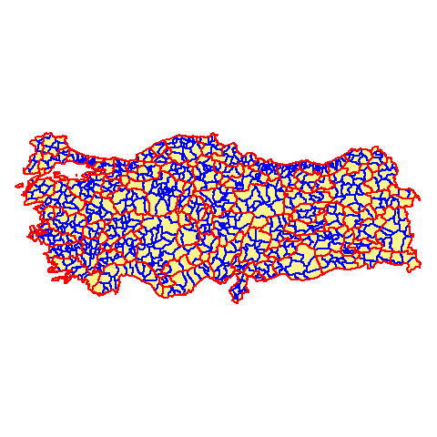

### Başlangıç

Bir haftasonu projesi olarak ortaya çıkan ggplot paketi ile türkiye haritası üzerinde görselleştirme yapmayı anlatacağım. İnternetteki birçok harita görselleştirmesi örnekleri genellikle Amerika üzerine. Ben de Türkiye haritasını nasıl oluşturabilirim diye araştırmaya başladım. Her ne kadar coğrafya ve coğrafik veriye dair bilgim olmasa da, biraz incelemeyle yol katettim.

Bu yolda aşağıdaki aşamaları izleyeceğiz:

* Türkiye'nin `shapefile` yani coğrafi verisini indireceğiz.
* Veriyi nasıl R'ye aktaracağımızı göreceğiz
* Aktardığımız verinin yapısını inceleyeceğiz.
* TÜİK'ten aldığımız veriyi birleştireceğiz.
* Haritayı oluşturacağız.

### İndirme

Öncelikle buradaki [http://www.gadm.org/country](http://www.gadm.org/country) linkten `Türkiye`'yi seçip, dosya formatı olarak da `R (SpatialPolygonsDataFrame)`'i seçiyoruz. Not olarak buradan indireceğiniz veriyi ticari amaçla kullanamazsınız.





İndirme kısmında `level 0`, `level 1` ve `level 2` göreceksiniz. Bunların anlamı yukarıda haritadaki çizgilerdir aslında. `level 0` il ve ilçelerin olmadığı sadece türkiye'nin şeklini oluştur. `level 1` kırmızı çizgileri yani şehirleri temsil eder. `level 2` de ilçeleri de gösterir. `level 2` yi indirdiğimizde aslında `level 1` ve `level 0`'ında verisine sahip olmuş oluyoruz ancak ihtiyacımız olmadığından `level 1`'i indiriyoruz.

### Veriyi R'ye Aktarmak

Veriyi aktarmadan önce bazı paketleri çağırıyoruz.
```{r}
library(tidyverse) 
library(sp) # Konumsal (Spatial) veri için
```

`SpatialPolygonsDataFrame` veriyi aktarmak için;
```{r}
TUR <- readRDS("TUR_adm1.rds")
```

Hızlıca `plot` fonksiyonuyla haritamıza bakabiliriz ancak biz görselleşmeyi ggplot ile yapacağız.
```{r}
plot(TUR)
```

### SpatialPolygonsDataFrame
Bu veri türü içinde `metadata` ve her ilin sınır kordinatlarının olduğu matrixler içeriyor.

Bizim uğraşacağımız kısım aslında `SpatialPolygonsDataFrame` içinde `data` kısmı ona da, `TUR@data` şeklinde ulaşabiliyoruz.

```{r}
TUR@data %>% as_tibble() %>% head(10)
```

`ID_0`: Ülke kimlik numarası diyebiliriz.  
`ID_1`: Şehirlerin kimlik numaraları, bu numaraları plaka kodları ile karıştırmayın.  
`ID_2`: Bu veride yok ancak ilçelerin kimlik numaraları  
Aynı şekilde,  
`NAME_0`: Ülke ismi  
`NAME_1`: Şehir isimleri  
`NAME_2`: İlçe İsimleri 


```{r}
ggplot(TUR, aes(x = long, y = lat)) +
  geom_polygon()
```

Grafiğin böyle olmasının sebebi ggplot'un verinin ne verisi olduğunu bilmemesinden, biraz düzeltelim.

```{r}
ggplot(TUR, aes(x = long, y = lat)) +
  geom_polygon(aes(group = group)) +
  coord_fixed()
```

Şehirleri ayırmak için de `fortify` fonksiyonunu kullanacağız. 

```{r}
TUR_for <- fortify(TUR) # Bu fonksiyon 'sp' paketinin içinde.

head(TUR_for)
```

Aslında, `SpatialPolygonsDataFrame` türünü `dataframe`'e çevirdi diyebiliriz. şehirlerin kordinatlarını `order`'a göre yerleştiriyor. `id` yukarıda bahsettiğim şehrin kimlik numarası.


```{r}
ggplot(TUR_for) + 
  geom_polygon(aes(x = long, y = lat,
                   group = group),
                   color = "white",
                   fill = "#97ECEA") +
  theme_void() + 
  coord_fixed()
```

### TÜİK Verisi

TÜİK'ten aldığım veriyi aktarmadan önce bahsetmeliyim ki, yukarıda gösterdiğimiz coğrafik verinin ve tüik verisinin doğru birleştirme yapmak için şehir isimlerinin birbiriyle uyuşması gerekiyor. Bu sebeple ben iki veride de bazı düzenlemeler yaptım. Şehir isimlerindeki Türkçe karakterleri İngilizceye çevirdim. Diğer bazı küçük düzenlemeleri aşağıda paylaştığım github linkimdeki `map.R` dosyasında bulabilirsiniz.

Daha hızlı ilerleyebilmek için `map.R` dosyasını aktarıyorum.

```{r echo=TRUE, message=FALSE, warning=FALSE, paged.print=FALSE}
source("map.R")
```

Üzerinde çalışacağım veri, ülke içindeki şehirlerin göç alma sayıları. TÜİK'ten aldığım veri 2014-2016 yılına ait ancak ben 2016 ait bir görselleştirme yapacağım.
```{r}
mig <- read_csv("migration/clean_migration.csv")

mig %>% head()

```

Öncelikle verideki şehir isimlerindeki türkçe karakterleri ingilizce karakterlere çevirelim.

```{r}
mig$aldigi_sehir <- tr_to_en(mig$aldigi_sehir) 
mig$sehir <- tr_to_en(mig$sehir)
```


İstanbul'un 2016'yılında aldığı göçü gösterelim. Bunun için de veriyi özelleştirelim.
```{r}
mig_ist_2016 <- mig %>%
  filter(yil == 2016, sehir == "Istanbul") %>%
  select(-c(yil,sehir))

mig_ist_2016 %>% head()
```


`TUR` verisindeki `ID_1` kimlik numaralarını TÜİK verisine dahil etmemiz gerekiyor. Bu sebeple, `left_join` ile `NAME_1` ve `aldigi_sehir`e göre birleştiriyoruz.

```{r}
id_and_cities_ist <- data_frame(id = rownames(TUR@data),
                            aldigi_sehir = TUR@data$NAME_1) %>% 
  left_join(mig_ist_2016, by = "aldigi_sehir")

id_and_cities_ist %>% head()
```

Son haritayı oluşturmak için yukarıdaki oluşturduğumuz `TUR_for` ile `id_and_cities_ist` verisini birleştiriyoruz.

```{r}
final_ist_map <- left_join(TUR_for, id_and_cities_ist, by = "id")

final_ist_map %>% head()
```

Haritayı oluşturmadan hemen önce 2016 yılında kaç kişi istanbul'a gelmiş diye bakalım.
```{r}
sum(mig_ist_2016$sayi)
```
Haritamız:
```{r}
ggplot(final_ist_map) +
  geom_polygon( aes(x = long, y = lat, group = group, fill = sayi),
                color = "grey") +
  coord_map() +
  theme_void() + 
  labs(title = "2016 Yılındaki İstanbul'un Aldığı Göç Sayısı",
       subtitle = paste0("Toplam Sayı: ", sum(mig_ist_2016$sayi)),
       caption = "Kaynak: Türkiye İstatistik Kurumu") +
  scale_fill_distiller(name = "Göç Sayısı",
                       palette = "Spectral", limits = c(0,20000), na.value = "black") +
  theme(plot.title = element_text(hjust = 0.5),
        plot.subtitle = element_text(hjust = 0.5))
```


Buradaki kodlara [github](https://www.github.com/sercandogan/turkeymap) adresinden ulaşabilirsiniz. Bir problem halinde bana da ulaşabilirsiniz, birlikte çözmeye çalışabiliriz.


